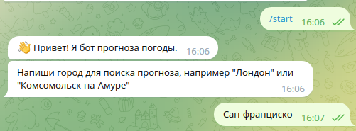
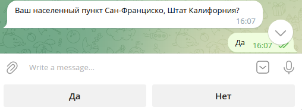
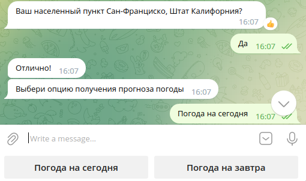
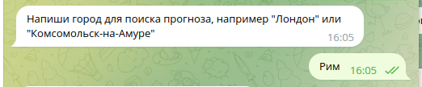
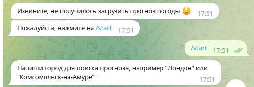
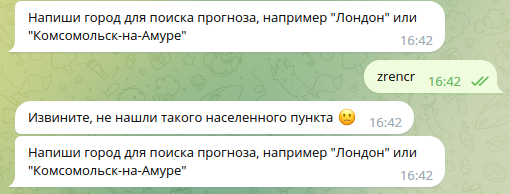

## Telegram бот для получения прогноза погоды

### Описание проекта

Данный бот используется для получения прогноза погоды с сервиса "Яндекс.Погода".
Для получения прогноза погоды используется парсинг с помощью Selenium. 
Данная библиотека выбрана для загрузки контента страниц, использующих JavaScript код. 

В качестве библиотеки для бота используется aiogram. 
Данная библиотека позволяет обрабатывать запросы в асинхронном режиме, что ускоряет работу бота для большого количества пользователей пользователей.


Данный проект использует технологию контейнеризации с помощью Docker, что упрощает процесс его развертывания.

### Инструкция по развертыванию проекта

Если установлен docker compose, то проект можно развернуть с помощью команды:
```
docker compose up --build
```

#### Развертывание без docker compose

1. В папке проекта создаем виртуальное окружение:
```
python -m venv venv
```

2. Активируем виртуальное окружение:

Для Windows:
```
venv\Scripts\activate
```

Для Linux и MacOS:
```
source venv\bin\activate
```

3. Устанавливаем необходимые пакеты:
```
pip install -r requirements.txt
```

4. Запускаем бота:
```
python bot_app/bot_engine.py
```

### Использование бота:

При получении команды /start бот отправляет приветствие с запросом для поиска города:



Далее следует запрос на подтверждение города:



При подтверждении города следует запрос на выбор опции:



При отказе от выбранного города присылается запрос на повторный выбор города:



При возникновении ошибки бот начинает диалог сначала:



При отсутствии города бот посылает запрос на повторный ввод:

